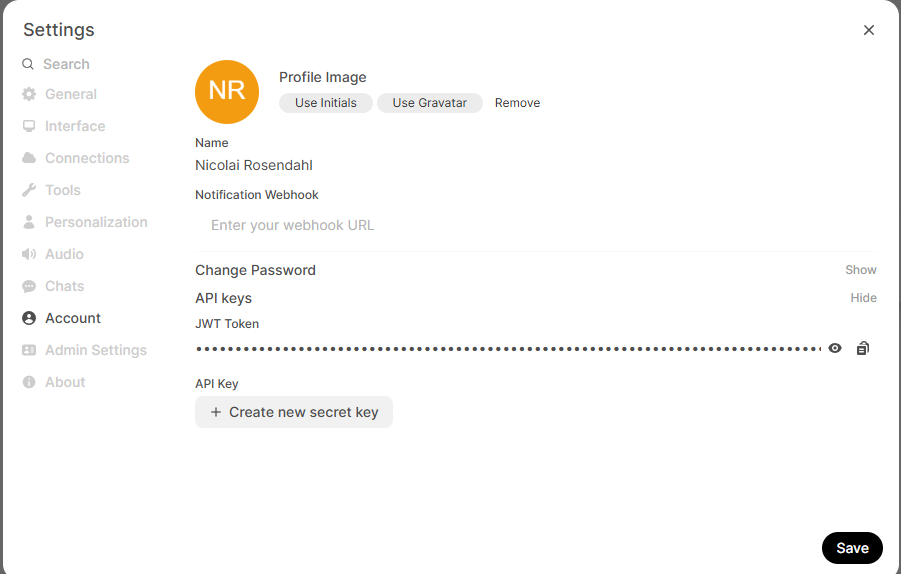
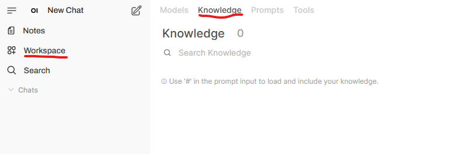
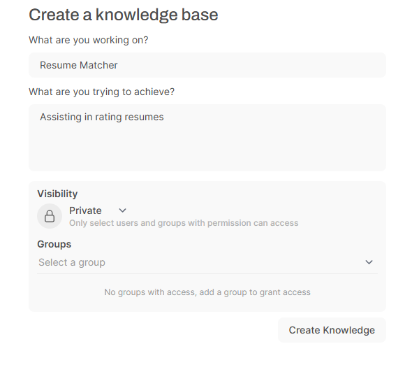
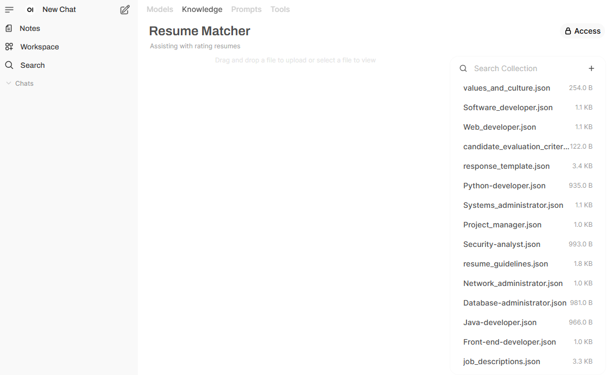

# AIML-Exam

### By Pelle Hald Vedsmand and Nicolai Rosendahl

Contains 2 parts.

#### - ML-part training models.

Trained on https://www.kaggle.com/datasets/gauravduttakiit/resume-dataset

1. We train a neural network for the first screening. We categorize the resume and see if the category matches. (Multi label)

2. We semantic compare the resume against the job requirements in a second screening giving more complex comparisations of actual skills.

#### - AI-part using pretrained LLMs in a RAG setup

#### Setting up the local AI.

The application uses Open WebUI's API to communicate with a locally installed AI. Below is a step to step guideline on installation and configuration of the local AI with and without NVIDIA GPU SUPPORT.

##### Step 1.
Spin up a docker container on an image that has Open WebUI with ollama support. 

```
docker run -d -p 3000:8080 -v open-webui:/app/backend/data --name open-webui ghcr.io/open-webui/open-webui:main
```

or with NVIDIA GPU support

```
docker run -d -p 3000:8080 --gpus all -v open-webui:/app/backend/data --name open-webui ghcr.io/open-webui/open-webui:cuda
```

##### Step 2.
Make sure you have ollama installed and start ollama. (This step can be skipped if you have the ollama app installed and running)

```
ollama serve
```

Open a new terminal and install the required model.

```
ollama run gemma3:4b
```

After installing the model use the following command to exit the chat.

```
/bye
```
 
##### Step 3.

Navigate to open webUI, press get started and create an admin account when prompted. 

```
http://localhost:3000/
```

Go to settings, open Account settings and retrieve your API key (Which is required to use the AI through the frontend app)



##### Step 4.

Navigate to workspace and into knowledge.



Add a new knowledge named

```Resume Matcher```

Add a description I.E

```Assisting in rating resumes```

Click 'Create Knowledge'



Click add content and choose Upload directory.

Upload all the content of [the companyDocs/json folder](/companyDocs/json/)

Your knowledge should now look something like this:



##### Step 5.

Your local AI is now setup and ready to use through the frontend application, on page "Ask your local AI for help".

Keep in mind for future usage it is needed to have ollama serve the models to Open WebUI and to have the docker container running.

### How to setup and run the project

You need a python version >= 3.11

Firstly start af terminal in the root of the project

`pip install -r requirements.txt`

#### Downloading of the models:

`python setupScripts/downloadRFModel.py`

`python setupScripts/downloadBertModel.py`

#### Launching the streamlit application

`cd Webapp`

`python -m streamlit run start.py`

### Documentation of the Machine Learning

The thoughts and reflections will be in this part of the README and in the .ipynb files:

- dataCleaning.ipynb
- BertTraining.ipynb
- ClassificationModels.ipynb
- dataExploration.ipynb
